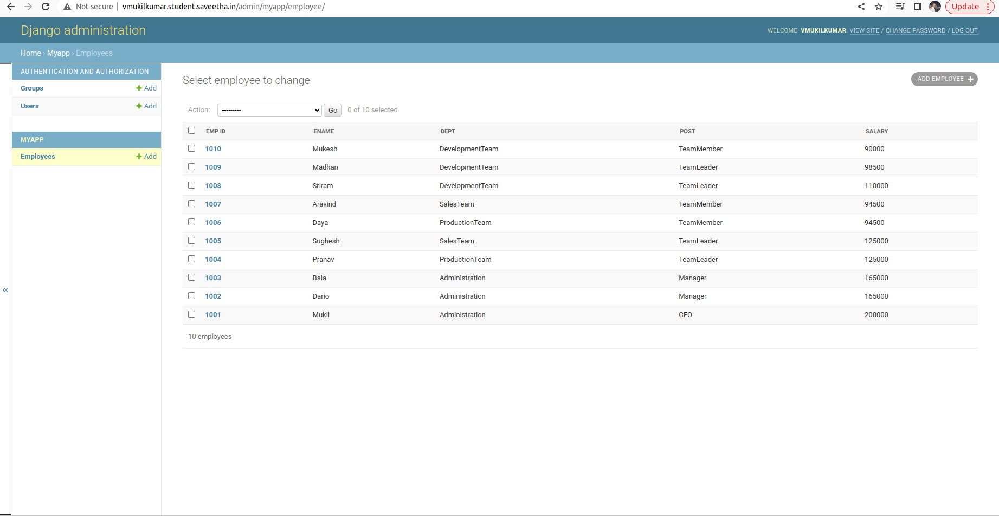

# Django ORM Web Application

## AIM
To develop a Django application to store and retrieve data from a database using Object Relational Mapping(ORM).

## Entity Relationship Diagram

Include your ER diagram here

## DESIGN STEPS

### STEP 1:

clone the repository to thea idea. start a new inside the project folder

### STEP 2:

type the appropriate code for your table and provide appropriate datatypes to the columns

### STEP 3:

create a report about project in readme.md file and upload the django-orm-app folder to your remote repository

## PROGRAM

````python
from django.db import models
from django.contrib import admin
# Create your models here.
class Employee(models.Model):
    emp_id=models.CharField(primary_key=True,max_length=4,help_text='Employee ID')
    ename=models.CharField(max_length=50)
    dept=models.CharField(max_length=50)
    post=models.CharField(max_length=20)
    salary=models.IntegerField()

class EmployeeAdmin(admin.ModelAdmin):
    list_display=('emp_id','ename','dept','post','salary')
````

## OUTPUT



## RESULT
Thus the project is developed to have Bus information database
